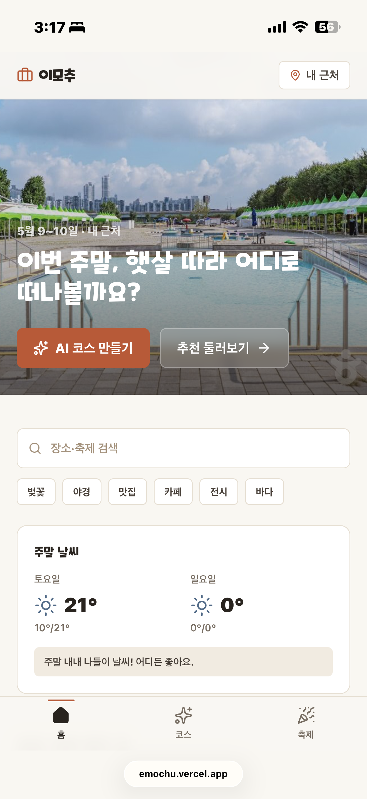
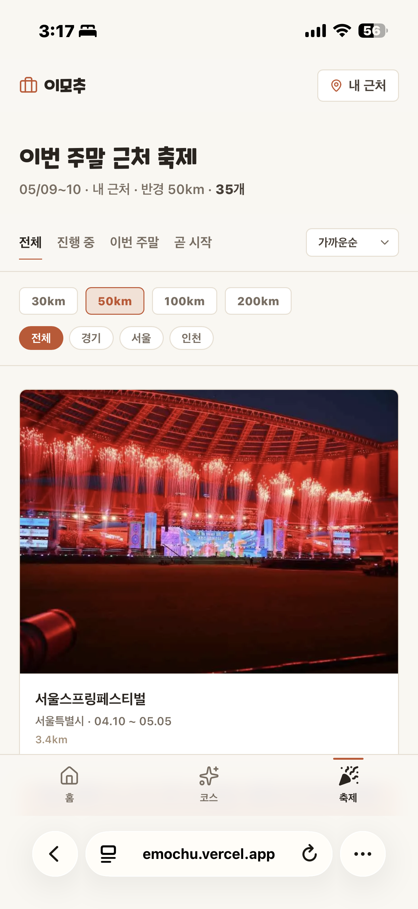

# 『2026 관광데이터 활용 공모전』 — ① 웹·앱 개발 부문 제안서

---

## 서비스명

**이모추 (이번 주에 모하지 추천)**
— 한국관광공사 TourAPI 와 AI 를 결합한 주말 나들이 코스 **초개인화** 큐레이션 서비스

- 서비스 URL: <https://emochu.vercel.app>
- GitHub: <https://github.com/gahusb/emochu> (public)

---

## 1) 서비스 기획배경 및 필요성

### 1. 서비스 기획 배경 — 왜 이모추인가?

*"주말에 뭐 하지?"* 라는 질문은 매주 반복되는 현대인의 고민입니다. 수많은 블로그와 SNS를 헤매며 정보를 찾지만, 의사결정 피로감에 지쳐 결국 평소 가던 곳으로 향하는 경우가 많습니다.

'이모추'는 이러한 탐색의 피로를 단 **5번의 탭**으로 해결하는 솔루션입니다. 사용자가 위치·기분·시간·동반자·취향을 선택하면, AI 가 한국관광공사의 실시간 공식 데이터를 분석해 최적의 동선이 고려된 맞춤형 관광 코스를 즉시 설계합니다.

단순한 유명 장소 나열을 넘어, TourAPI 를 활용해 숨겨진 지역 명소와 현재 진행 중인 다채로운 축제 정보를 자연스럽게 코스에 녹여냅니다. 이를 통해 사용자는 새로운 관광 자원을 발견하는 흥미를 느끼고, 나아가 지역 관광 활성화에 기여하는 **'발견의 경험'**을 제공하고자 합니다.

### 2. 서비스 필요성

| 기존 탐색 방식의 한계 | 이모추가 제공하는 혁신 가치 |
|---|---|
| 파편화된 정보의 수동 종합 노동 | AI 가 TourAPI 다중 엔드포인트를 자동 분석·종합 |
| 단일 장소 위주의 파편적 추천 | 시간 흐름과 동선이 담긴 완성형 코스 제공 (반나절~1박2일) |
| 운영시간·날씨 미반영 정보 | 기상청 단기예보·운영시간·편의시설 데이터를 실시간 반영 |
| 공유의 불편함 (단순 텍스트·링크) | 코스별 영구 URL + OG 썸네일 자동 생성으로 원활한 소셜 공유 |
| 숨은 지역 자원의 낮은 노출도 | 비수도권·진행 중인 축제에 가중치를 부여해 로컬 자원 발견 유도 |

한국관광공사가 발표한 **2026 관광 트렌드 「D.U.A.L.I.S.M.」** 중 이모추는 **Digital Humanity** *(맥락을 이해하는 AI 조력자)*, **Spatial Experience** *(시간 흐름에 따른 공간 경험)*, **Local Re-creation** *(지역 고유 가치 재발견)* 3가지 핵심 키워드를 서비스로 완벽히 구현해 냈습니다.

---

## 2) 서비스 개요

### 1. 기획 서비스 소개

사용자의 위치·기분·동반자 등 **5가지 컨텍스트**를 바탕으로, 한국관광공사 TourAPI 와 AI 가 **10초 만에** 주말 나들이 코스를 설계하고 카카오톡 공유까지 지원하는 **원스톱 큐레이션 서비스**입니다.

### 2. 기획 서비스 주요 기능

- **5단계 AI 코스 위저드**: 목적지(GPS·도시) → 기분(6종) → 시간(반나절~1박2일) → 동반자(혼자·연인·가족·친구) → 취향(자연·맛집·문화 등) 입력 기반 맞춤 설계
- **타임라인 + 반응형 지도 UI**: 시간순으로 배열된 코스 카드(관광지·맛집·카페·축제·숙박 5종 컬러 구분) 와 카카오맵 마커 양방향 연동
- **통합 장소 상세 페이지**: 이미지 갤러리·운영시간·홈페이지·핵심 편의시설(주차·유모차·반려동물 등) 정보를 Next.js Intercepting Routes 를 활용해 **모달과 영구 URL 로 동시 지원**
- **원클릭 소셜 공유**: 생성된 코스에 대한 고유 URL 발급 + OG 메타데이터(썸네일·제목 등) 자동 생성으로 카카오톡 공유 최적화
- **실시간 축제 매거진**: 진행 중·이번 주말·곧 시작·D-Day 4단계 상태 뱃지로 시의성 높은 지역 행사 정보 즉시 파악

### 3. 서비스 차별성

- **다중 API 통합 파이프라인** *(데이터 활용 깊이)*: 공모전 필수 요건(3개 이상)을 훌쩍 넘는 **TourAPI 11개 엔드포인트 클라이언트**를 구축하고, 그중 9개를 코스 생성 시 단일 코스 객체로 실시간 결합하는 자체 데이터 파이프라인을 구축했습니다.
- **비정형 데이터의 사용자 친화적 정제**: TourAPI `detailIntro2` 의 **25개 이상 비정형 텍스트 필드** 중 사용자의 의사결정에 가장 중요한 5대 핵심 신호(주차·유모차·키즈·반려동물·운영시간) 만 자동 추출하는 분류기를 구현하여 직관적인 카드 UI 로 제공합니다.
- **하이브리드 AI 아키텍처** *(안정성 + 정확성 확보)*: AI 의 **환각(Hallucination)** 현상을 방지하기 위해 결정론적 규칙(감정·동반자·편의시설 스코어링)으로 후보군을 1차 필터링합니다. AI 는 좁혀진 후보군 내에서 순서·시간 배치만 담당하며, contentId 교차검증 및 이동거리 자체 계산(Haversine)을 통해 데이터 정합성을 철저히 보증합니다.
- **사용자 데이터 자산화**: 생성된 코스는 DB(Supabase) 에 영구 저장되어, 향후 한국관광공사 공공 데이터에 사용자 행동 패턴이 결합된 **새로운 파생 데이터 자산**으로 축적됩니다.
- **웹 접근성 및 높은 사용성**: Next.js 16 최신 라우팅 기법을 적용한 부드러운 UX 와 더불어, **스크린 리더·키보드 네비게이션, ARIA 레이블·포커스 스타일·동작 줄이기(reduced-motion) 대응** 등 웹 접근성을 적극 반영했습니다.

**▣ 서비스 화면 예시**

|  |  |
|:---:|:---:|
| **홈** — 매거진 레이아웃: 주말 날씨·진행 중인 축제·AI 코스 추천 카드 통합 | **축제 페이지** — 매거진 그리드 |

---

## 3) 데이터 활용 방안

### 1. 활용 예정 한국관광공사 OpenAPI

**TourAPI 4.0 KorService2 — 11개 엔드포인트 클라이언트 구축, 코스 생성 시 9개 실시간 호출** (2026-05-06 운영 기준)

| API 엔드포인트 | 활용 용도 |
|---|---|
| `searchFestival2`, `locationBasedList2`, `areaBasedList2`, `searchStay2` | 주변 축제·위치/지역 기반 관광지·음식점·1박2일용 숙박 후보 검색 |
| `detailCommon2`, `detailIntro2`, `detailImage2`, `detailInfo2` | 장소 소개·좌표·운영/편의시설 신호 추출·이미지 갤러리 구성 |
| `searchKeyword2`, `areaCode2`, `categoryCode2` | 장소 검색·지역 및 분류 코드 매핑 시스템 구축 |

**보조 API 활용**: 기상청 단기예보 API · 카카오맵 SDK

### 2. 데이터 활용 방식

- **동시 다중 호출 (`Promise.all`)**: 사용자의 조건 입력 시 `locationBasedList2`·`searchFestival2`·`searchStay2` 등을 비동기 동시 호출하여 순차 호출 대비 **응답 시간을 크게 단축** 합니다.
- **하이브리드 스코어링·필터링**: 추출된 장소 데이터(`contentTypeId` 기준 관광지·축제·음식점 등 분류) 에 날씨(맑음=야외 보너스) 및 사용자 취향 가중치를 부여하여 최적의 후보군을 선별합니다.
- **데이터 정제 (`detailIntro2` 보강)**: 선별된 후보군의 비정형 상세 정보에서 핵심 편의시설(주차·반려동물 등) 유무를 판별하여 **데이터의 실용성을 극대화** 합니다.
- **AI 코스 최적화·검증**: 정제된 데이터를 기반으로 시간대별 코스를 JSON 형태로 생성하며, **자체 검증 로직** (좌표·이동거리·API ID 매칭) 을 거쳐 최종 사용자 화면에 렌더링합니다.

---

## 4) 서비스 발전 방향

### 1. 개발 서비스 향후 발전 방향

공모전 출품은 서비스의 완성형이 아닌 **출발점**입니다. 5월~9월 지원 기간을 활용해 다음의 고도화를 추진합니다.

- **Phase 1. 글로벌 확장 + 무장애 관광 포용**: TourAPI 다국어 서비스(EngService / JpnService) 연동을 통한 외국인 관광객 지원. **무장애 필드**를 추가 도입하여 휠체어·고령 사용자 친화적 추천 코스 제공.
- **Phase 2. 소셜 기능 및 개인화 강화**: 생성된 코스 저장·방문 인증·리뷰 작성 기능 도입. 유저 브라우저 ID 기반의 **개인화된 코스 아카이브** 제공.
- **Phase 3. 성능 최적화·인프라 고도화**: Gemini Streaming(SSE) 을 통한 코스 점진적 생성 UX 개선, API 캐싱 전략 고도화 및 Edge Runtime 전환으로 글로벌 스케일의 트래픽 대응력 확보.

### 2. 기대 효과 및 지속 가능성

| 구분 | 기대 효과·지속 가능성 전략 |
|---|---|
| **개인 및 사회** | 주말 나들이 의사결정 시간을 10초로 단축. 가족·반려동물 동반·고령 사용자 등 **다양한 계층의 관광 접근성** 대폭 향상 |
| **지역 관광 활성화** | 비수도권·신규 축제 데이터에 가중치를 부여하여 특정 관광지 쏠림 현상을 완화하고 **지역 분산 및 재생형 관광**에 기여 |
| **데이터 자산화** | 사용자들의 코스 생성 기록이 DB 에 누적됨에 따라, 향후 유사 조건 사용자에게 **AI 추가 호출 없이** 최적의 코스를 즉시 제공하는 선순환 구조(비용 효율성) 달성 |
